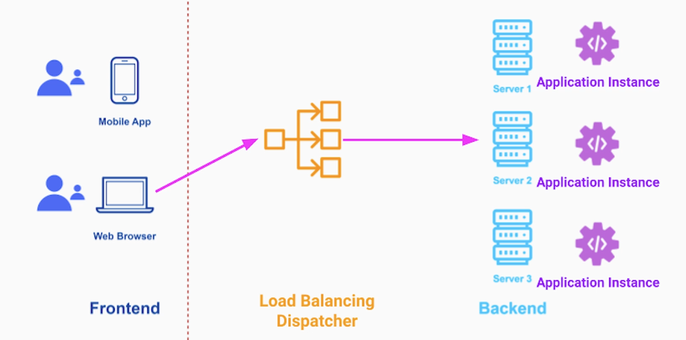
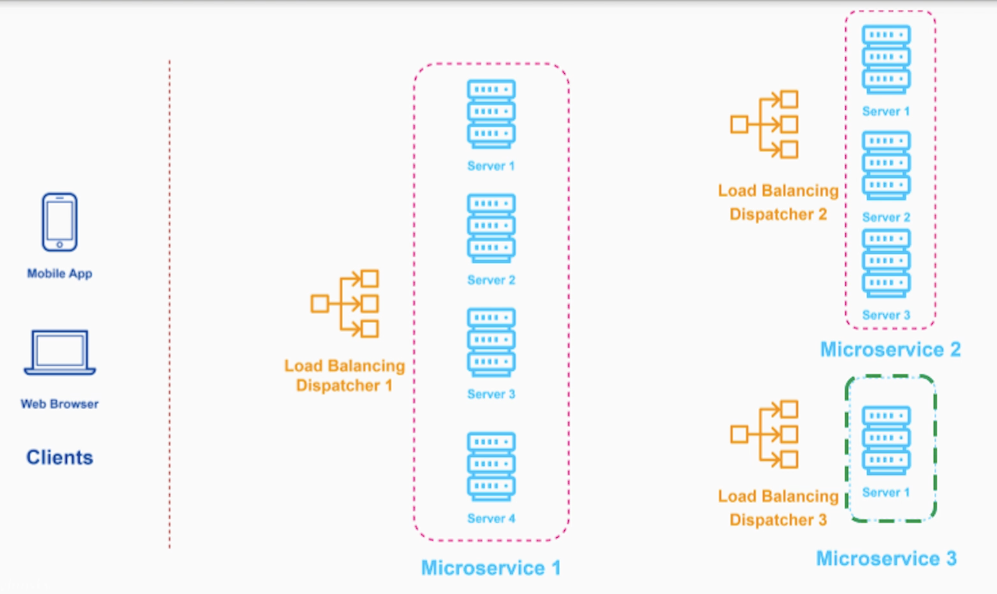
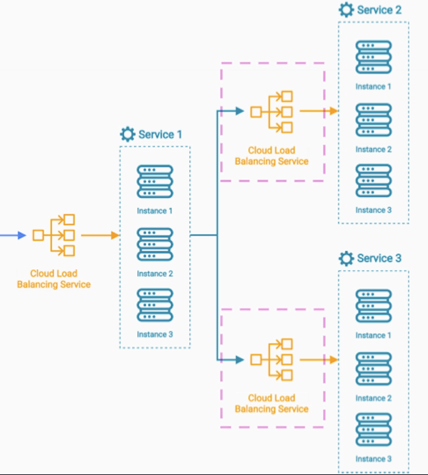
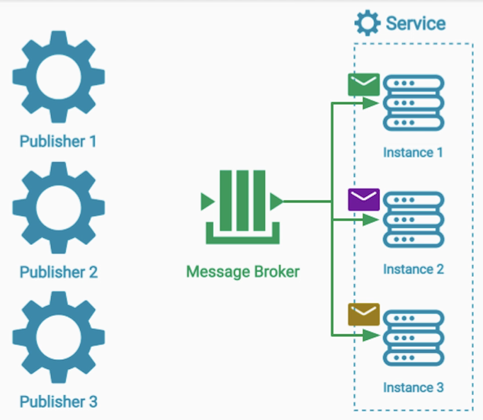

# Section 2: Scalability Patterns

- [Load Balancing Pattern - Software Architecture & Cloud Computing Use Cases](#load-balancing-pattern---software-architecture--cloud-computing-use-cases)

---

## Load Balancing Pattern - Software Architecture & Cloud Computing Use Cases

### Scalability Patterns

- The most important patterns that allow us to
  - Architect
  - Deploy a highly scalable system
- Scalability patterns enable us
  - Handle billions of requests / day
  - Process petabytes of data
  - Save costs

---

### Problem Description

Example

Digital News System with millions of customers reading the news on mobile / web.

When the incoming traffic, exceeds the CPU, memory or network capacity of a single server it will either crash or 
significantly degrate it's performance.
- upgrading that server to a more powerful VM will only delay this problem

---

### Load Balancing Pattern

- Load Balancing pattern helps us take advantage of "infinite" access to cloud computers

The Load Balancing as a pattern places a dispatcher between the source of the data (requests) and the workers that process that data

The dispatcher routes each request from the client to only one of the available workers
- if the number of clients grows we can add more workers and spread the load
- allows us to scale our system very quickly without changes needed to our system

---

### HTTP requests from the frontend to the backend

The requests all go to the load balancing dispatcher. 

The dispatcher routes each request to one of the application instances.

---

### Microservices Architecture

If we have a multi-service architecture, we can deploy each service as a group of identical application instances.

All the communication to that group of instances will also be through this dispatcher

This way we can **scale each service completely independently**

---

### Load Balancing - Implementation Techniques

### 1. Loading Balancing with Cloud Load Balancing Service

Based on the configured algorithms routes requests to a group of servers

If we deploy our servers instances in different isolation zones, then the load balancing service may also run as multiple instances
one in each zone

As the traffic to our system grows, that cloud load balancing service may scale itself up and run as a group of LB instances

Additionally, each Load Balance instance is monitored and automatically restarted if something happens
- No single point of failure

We can use Cloud Load Balancing Service internally between groups of services

---

### 2. Load balancing Pattern with Message Broker

We can have one or multiple publishers sending message to the message broker

On the receiving end, we can have a group of consumer workers that read those messages
- we can scale the consumer instances up / down as we need to

**Message Broker - Implementation Notes**
- The main purpose of a message broker is **not** load balancing
- Nevertheless, in the right use case it can do a good job at load balancing
  - When the comminication between the publisher and consumer service is **One directional / asynchronous**
  - The receiver doesn't need to / expect to get any response of the consumer after the message has been published
- Should be used **internally between services only**

Modern message broker solutions are implemented as distributed systems that use
- Replication
- Redundancy
- run as a group of instances

---

### Load Balancing Pattern - Implementation Considerations

- Which algorithm to use for routing requests to workers

---

### Load Balancing Pattern - Routing Algorithms

### Round Robin Algorithm

The Load balancer is routing each incoming request sequentally to the next worker instance
- Default Load Balancing algorithm
- Works well when the application is stateless
  - Each request can be handled by any application servers
- Doesn't work when we need to maintain an active session between the client and the server

**Authentication**

Example of active session:

After authenticating the user, we keep the user's credentials on the server side to make any subsequent request faster.
- if we use round robin, the client will have to re-authenticate every time

**Multipart File Upload**

The client upload a very big file which is broken down into multiple requests
- we need to make sure that all requests are going to the **same server**

---

### Sticky Session / Session Affinity Algorithm

The Load Balancer tries it's best to send traffic of a given client to the same server, as long as that server is healthy

Can be achieved by **placing a cookie** on the client's device which will be sent with every request to the Load Balancer

Another way is to inspect user's IP address
- every request can be tracked and routed to the same server
- works great for relatively short sessions

Too many connections ➡️ Disproportionally High Load

---

### Least Connections Algorithm

The Load Balancer will route new request to servers that have the least number of already established connections open

Particularly usefull for tasks associated with long term connections
- SQL, LDAP, etc

---

### Auto Scaling 

Every cloud computing instance such as a physical or VM, runs a few background processes called agents.

Agents collect data about the network traffic, memory consumption, CPU utilization on each host.

Using the real time data collected from each server we can define **Auto-Scaling Policies** 
to increase or decrease the number of servers dynamically base on those metrics.

Cloud ventors allows to tie those autoscaling policies to the Load Balancing service.

Load Balancing is aware of the size and addresses of the backend servers at any given moment.

**Combination**
- Dynamic resizing
- Load Balancing

allows us to auto scale up / down

---

### Summary

- Learned about the Load Balancing Pattern
- General overview - dispatching every request from a sender to **only one** worker
- Ways to implement Load Balancing
  - Cloud Load Balancing Service
  - Message Broker
- Strategies and algorithms based on
  - Statelessness / Statefulness of the application
  - Duration of the connection / session between the client and the server
- Combination between Auto-scaling and Load Balancing

---

