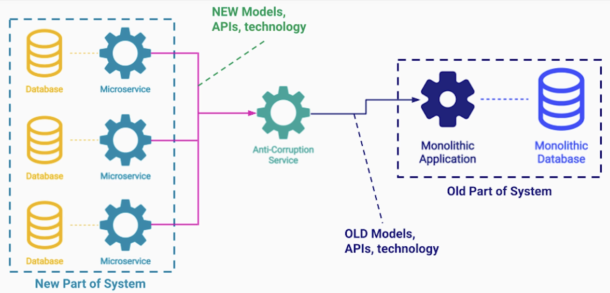
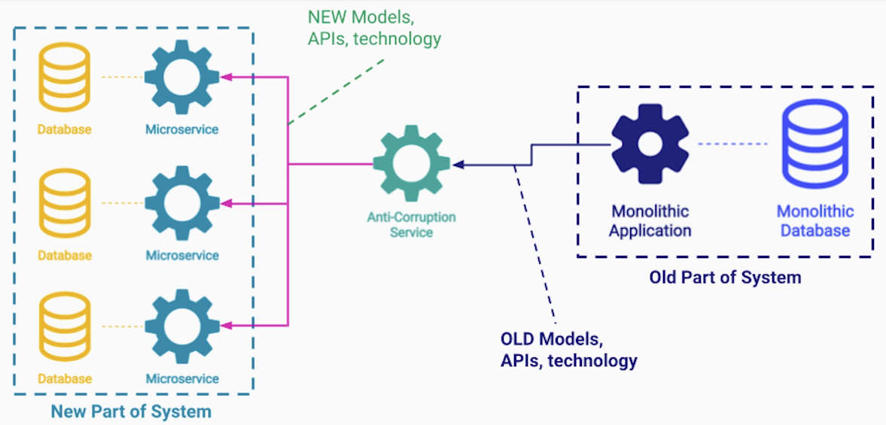
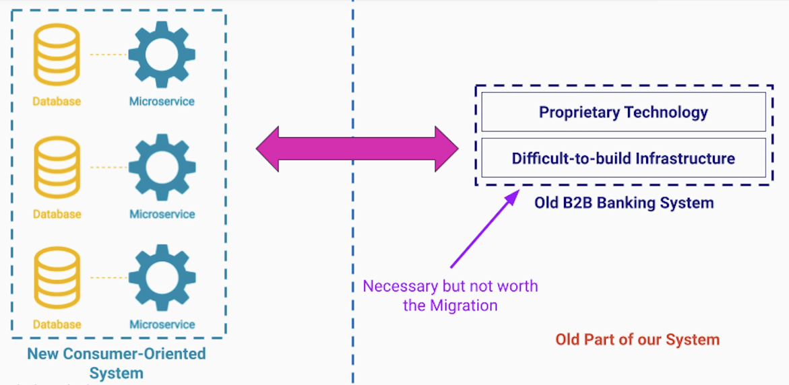
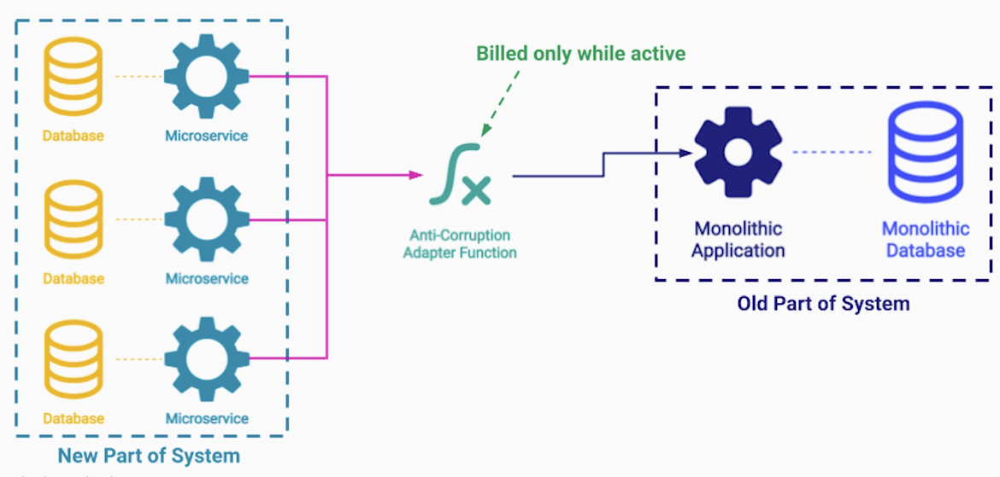

# Section 4: Software Extensibility Architecture Patterns

- [Sidecar & Ambassador Pattern](#sidecar--ambassador-pattern)
- [Anti-Corruption Adapter Pattern](#anti-corruption-adapter-pattern)

---

## Sidecar & Ambassador Pattern

## Problem Statement

**Core Functionality of Services**

- Web Server
  - Server web content
- Customers Service
  - Store customer info.
- Payment Service
  - Collect payments

**Additional Functionality** beyond it's core business logic

- Web Server
  - Internal metrics
  - Log events
  - Connect to registry
  - Pull config
  - ...
- Customers Service
  - Internal metrics
  - Log events
  - Connect to registry
  - Pull config
  - ...
- Payment Service
  - Internal metrics
  - Log events
  - Connect to registry
  - Pull config
  - ...

---

### Code Reusability - First Attempt (Library)

We can reuse a library in each codebase

**Issue**: We may need to utilize different programming languages for different problems

We can't use the same library across multiple services

**Additional Issues with a Shared Library**

- Scalability
- Incompatibility or inconsistency between different languages
  - Different data types
  - Bugs in different versions of implementations
- Deploying shared functionalities as separate services
  - Overkill and problematic

**Best solution**: Sidecar Pattern

---

### Sidecar Pattern

We take the additional functionality and run it as a separate process / separate container
on the same server as the main application

**Benefits**

- Isolation between main server and sidecar process
- Still share the same host
  - Fast, Reliable Communication
- Main application + sidecar Process have access to same resources
  - File system
  - CPU
  - Memory

This way the sidecar can
- Monitor the CPU / memory
- Report it
- Can also read the application log files
- Update it's configuration files easily (no network communication)

Also the isolation we get by running the sidecar as a separate process
- Allows us to implement the sidecar in one language once and reuse it
- Deploy one upgrade to all instances

---

### Ambassador Sidecar Pattern

An ambassador is a special sidecar that is responsible for sending all the network requests on behalf of the service

It is like a **Proxy** but it runs on the same host as the core application

**Benefits**
- We offload all the complex network communication logic outside of the service
- Codebase of the core service has only Business Logic

**Ambassador responsibilities**
- Retries
- Disconnections
- Authentication
- Routing
- Protocol Versions

We can perform distributed tracing across multiple services

Example: Troubleshoot a transaction that spans multiple services

---

### Summary

- Sidecar Pattern extends the functionality of a service
  - No need to **reimplement** in every programming language
  - No need to **deploy** as a service on additional hardware
- Sidecar benefits
  - **Isolation** between the sidecar and the core application
  - Has **access** to the same **resources**
  - **Low overhead** of interprocess communication
- Ambassador Sidecar Pattern offloads
  - **Network** communication
  - **Security** from the core application to the sidecar

---

## Anti-Corruption Adapter Pattern

### Anti-Corruption Adapter / Layer Pattern

**Scenarios Pattern Applied**

- Migration
  - Anti-Corruption Layer is temporary
- Two Part System
  - Anti-Corruption Layer is permanent

Example: Monolithic Application
- 10 year old code
- Old technologies
- Complex DB schema
- Code is too complex
- Team is too big
- Exposed via outdated API

---

### From Monolithic Architecture to Microservices Architecture

- During the migration we want to
  - Modernize the system
  - End up with a modern technology stack
- Issues
  - We cannot stop all development during the migration

---

### Splitting Monolith Into Microservices

- We take a small isolated part of the monolithic application
- Create a brand new service with each own Database for that functionality
- Run it together with the original monolith
- We repeat the process over and over until the original monolith is gone

However, until we get to all microservices solution, the small set of microservices, still rely to the old monolithic application for some functionality and data

---

### Problem Statement: Corruption

New Part of System that neads to support old protocols / APIs and data models of the old part of the system

This leads to **Corruption** of the new and clean services that now have to carry legacy code all around it's codebase until the migration is complete

---

### Anti-Corruption Pattern

We deploy a new service between the old system and the new system, that acts as an adapter

The Anti-corruption service performs all the translations and forwards the request to that old monolithic application

Similar if the old monolithic application needs to talk to any of the new microservices, it talks only to the Anti-Corruption Adapter Service

---

### Banking Company Example (Two Parts System)

---

### Anti-Corruption Layer Important Notes

- Anti-Corruption Service needs
  - Development
  - Testing
  - Deployment
  - Scalability

---

### Anti-Corruption Layer Overhead

- Anti-Corruption Service will always have some
  - Performance overhead (latency)
  - Additional **cost** on the cloud environment

---

### Anti-Corruption Pattern with FaaS

One way to mitigate the issue of cost is to deploy the adapter as a FaaS

---

### Summary

- Learned about the Anti-Corruption Adapter / Layer Pattern
- Two scenarios for the pattern
  - Migration between architectures
  - Running 2 systems permanently side-by-side
- Challenges
  - Resources (Additional service to maintain)
  - Development
  - Latency

---

