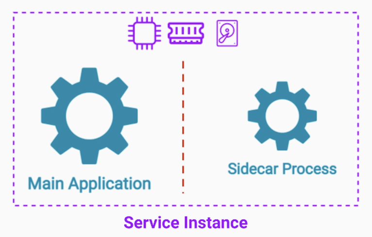
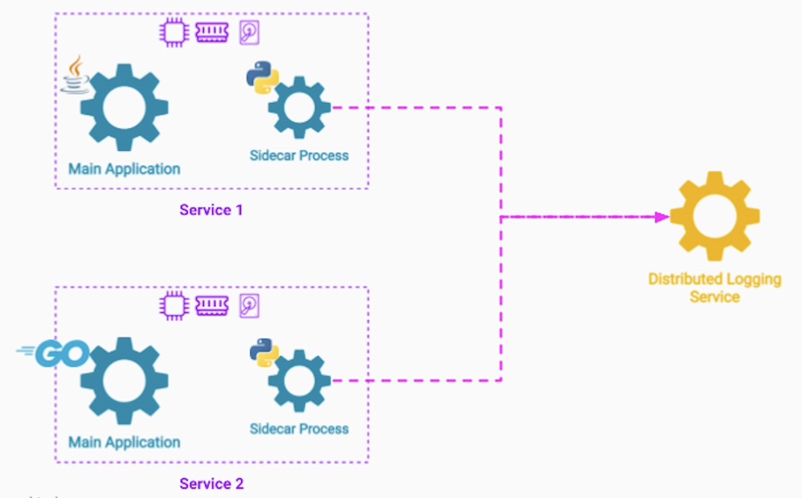

# Section 4: Software Extensibility Architecture Patterns

- [Sidecar & Ambassador Pattern](#sidecar--ambassador-pattern)

---

## Sidecar & Ambassador Pattern

## Problem Statement

**Core Functionality of Services**

- Web Server
  - Server web content
- Customers Service
  - Store customer info.
- Payment Service
  - Collect payments

**Additional Functionality** beyond it's core business logic

- Web Server
  - Internal metrics
  - Log events
  - Connect to registry
  - Pull config
  - ...
- Customers Service
  - Internal metrics
  - Log events
  - Connect to registry
  - Pull config
  - ...
- Payment Service
  - Internal metrics
  - Log events
  - Connect to registry
  - Pull config
  - ...

---

### Code Reusability - First Attempt (Library)

We can reuse a library in each codebase

**Issue**: We may need to utilize different programming languages for different problems

We can't use the same library across multiple services

**Additional Issues with a Shared Library**

- Scalability
- Incompatibility or inconsistency between different languages
  - Different data types
  - Bugs in different versions of implementations
- Deploying shared functionalities as separate services
  - Overkill and problematic

**Best solution**: Sidecar Pattern

---

### Sidecar Pattern

We take the additional functionality and run it as a separate process / separate container
on the same server as the main application

**Benefits**

- Isolation between main server and sidecar process
- Still share the same host
  - Fast, Reliable Communication
- Main application + sidecar Process have access to same resources
  - File system
  - CPU
  - Memory

This way the sidecar can
- Monitor the CPU / memory
- Report it
- Can also read the application log files
- Update it's configuration files easily (no network communication)

Also the isolation we get by running the sidecar as a separate process
- Allows us to implement the sidecar in one language once and reuse it
- Deploy one upgrade to all instances

---

