# Section 4: Software Extensibility Architecture Patterns

- [Sidecar & Ambassador Pattern](#sidecar--ambassador-pattern)
- [Anti-Corruption Adapter Pattern](#anti-corruption-adapter-pattern)
- [Backends for Frontends Pattern](#backends-for-frontends-pattern)

---

## Sidecar & Ambassador Pattern

## Problem Statement

**Core Functionality of Services**

- Web Server
  - Server web content
- Customers Service
  - Store customer info.
- Payment Service
  - Collect payments

**Additional Functionality** beyond it's core business logic

- Web Server
  - Internal metrics
  - Log events
  - Connect to registry
  - Pull config
  - ...
- Customers Service
  - Internal metrics
  - Log events
  - Connect to registry
  - Pull config
  - ...
- Payment Service
  - Internal metrics
  - Log events
  - Connect to registry
  - Pull config
  - ...

---

### Code Reusability - First Attempt (Library)

We can reuse a library in each codebase

**Issue**: We may need to utilize different programming languages for different problems

We can't use the same library across multiple services

**Additional Issues with a Shared Library**

- Scalability
- Incompatibility or inconsistency between different languages
  - Different data types
  - Bugs in different versions of implementations
- Deploying shared functionalities as separate services
  - Overkill and problematic

**Best solution**: Sidecar Pattern

---

### Sidecar Pattern

We take the additional functionality and run it as a separate process / separate container
on the same server as the main application

**Benefits**

- Isolation between main server and sidecar process
- Still share the same host
  - Fast, Reliable Communication
- Main application + sidecar Process have access to same resources
  - File system
  - CPU
  - Memory

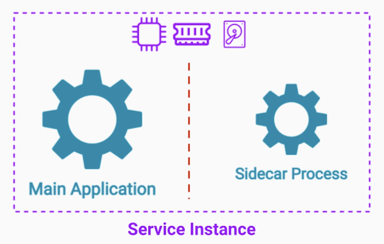

This way the sidecar can
- Monitor the CPU / memory
- Report it
- Can also read the application log files
- Update it's configuration files easily (no network communication)

Also the isolation we get by running the sidecar as a separate process
- Allows us to implement the sidecar in one language once and reuse it
- Deploy one upgrade to all instances

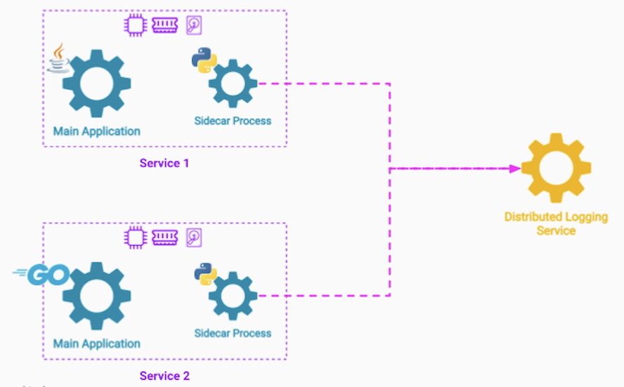

---

### Ambassador Sidecar Pattern

An ambassador is a special sidecar that is responsible for sending all the network requests on behalf of the service

It is like a **Proxy** but it runs on the same host as the core application

**Benefits**
- We offload all the complex network communication logic outside of the service
- Codebase of the core service has only Business Logic

**Ambassador responsibilities**
- Retries
- Disconnections
- Authentication
- Routing
- Protocol Versions

We can perform distributed tracing across multiple services

Example: Troubleshoot a transaction that spans multiple services

---

### Summary

- Sidecar Pattern extends the functionality of a service
  - No need to **reimplement** in every programming language
  - No need to **deploy** as a service on additional hardware
- Sidecar benefits
  - **Isolation** between the sidecar and the core application
  - Has **access** to the same **resources**
  - **Low overhead** of interprocess communication
- Ambassador Sidecar Pattern offloads
  - **Network** communication
  - **Security** from the core application to the sidecar

---

## Anti-Corruption Adapter Pattern

### Anti-Corruption Adapter / Layer Pattern

**Scenarios Pattern Applied**

- Migration
  - Anti-Corruption Layer is temporary
- Two Part System
  - Anti-Corruption Layer is permanent

Example: Monolithic Application
- 10 year old code
- Old technologies
- Complex DB schema
- Code is too complex
- Team is too big
- Exposed via outdated API

---

### From Monolithic Architecture to Microservices Architecture

- During the migration we want to
  - Modernize the system
  - End up with a modern technology stack
- Issues
  - We cannot stop all development during the migration

---

### Splitting Monolith Into Microservices

- We take a small isolated part of the monolithic application
- Create a brand new service with each own Database for that functionality
- Run it together with the original monolith
- We repeat the process over and over until the original monolith is gone

However, until we get to all microservices solution, the small set of microservices, still rely to the old monolithic application for some functionality and data

---

### Problem Statement: Corruption

New Part of System that neads to support old protocols / APIs and data models of the old part of the system

This leads to **Corruption** of the new and clean services that now have to carry legacy code all around it's codebase until the migration is complete

---

### Anti-Corruption Pattern

We deploy a new service between the old system and the new system, that acts as an adapter

The Anti-corruption service performs all the translations and forwards the request to that old monolithic application

Similar if the old monolithic application needs to talk to any of the new microservices, it talks only to the Anti-Corruption Adapter Service

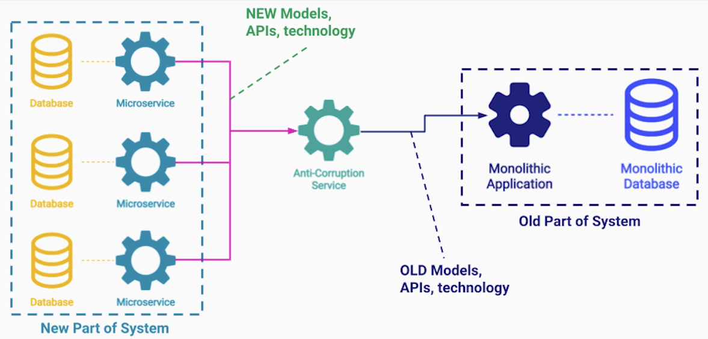

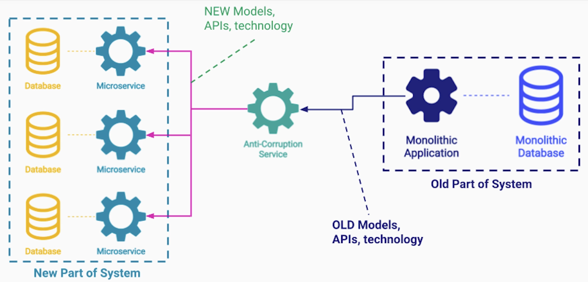

---

### Banking Company Example (Two Parts System)

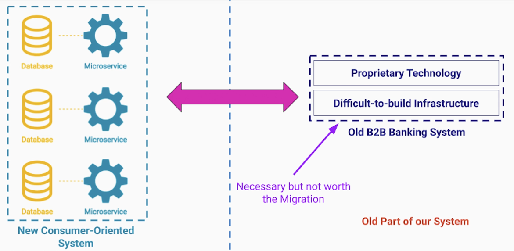

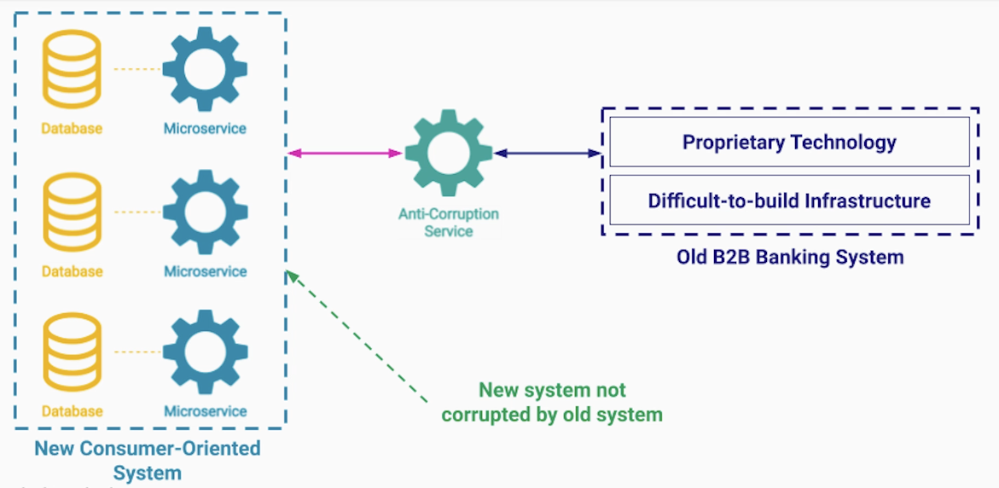

---

### Anti-Corruption Layer Important Notes

- Anti-Corruption Service needs
  - Development
  - Testing
  - Deployment
  - Scalability

---

### Anti-Corruption Layer Overhead

- Anti-Corruption Service will always have some
  - Performance overhead (latency)
  - Additional **cost** on the cloud environment

---

### Anti-Corruption Pattern with FaaS

One way to mitigate the issue of cost is to deploy the adapter as a FaaS

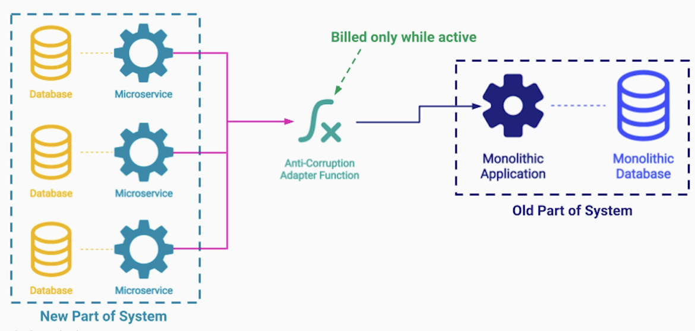

---

### Summary

- Learned about the Anti-Corruption Adapter / Layer Pattern
- Two scenarios for the pattern
  - Migration between architectures
  - Running 2 systems permanently side-by-side
- Challenges
  - Resources (Additional service to maintain)
  - Development
  - Latency

---

## Backends for Frontends Pattern

**BFFs - Backends For Frontends**

### Problem Statement

**Example: E-Commerce System Archicture**

In the middle, short of the edge of our system we have the backend that serves the frontend code
- servers static and dynamic content
- also handles requests for additional web pages / data

The problem begins, as always with large scale systems, when our company becomes more successfull
- front-end code becomes more complex / rich in features
- back-end also becomes more complex

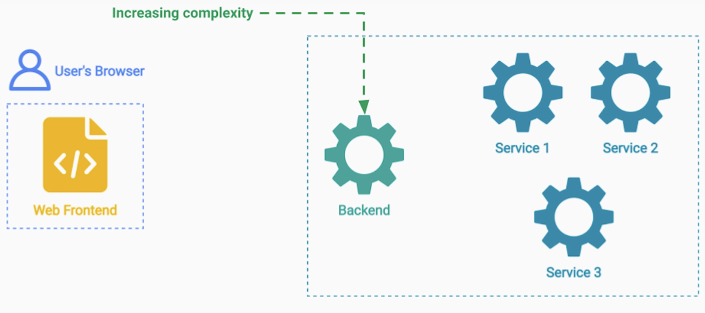

As some point we may also introduce a front-end for mobile devices
- we start adding mobile specific code
- mobile specific features to the back-end
  - e.g. new APIs that send less or maybe even slightly different data
  - also should be more cautious about mobile devices battery life

We need to rethink the entire UX to 
- minimize the number of network requests
- offload work from frontend to backend
- also mobiles have native features like
  - mobile camera to e.g. scan a barcode
  - location based request

Desktop have larger screens so they need to see more data

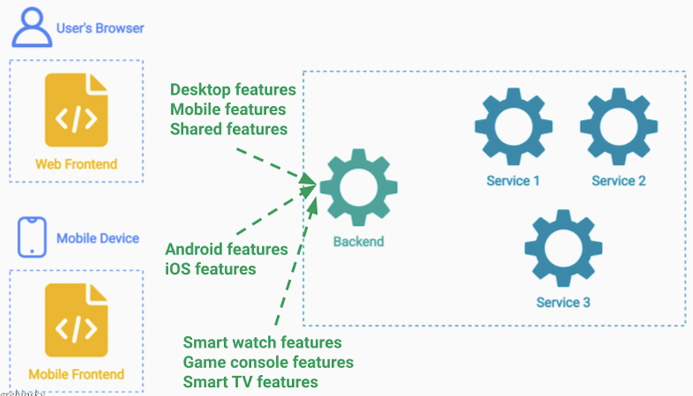

Now we have a backend service that has to support features for multiple types of frontends
- Desktop features
- Mobile features
- Shared features
- also may extend to support platform specific features for iOS or android
- may add more types of devices
  - Smart watch features
  - Game console features
  - Smart TV features

The problem is that this monolithic backend service is now very
- **big**
- **complex**
- **full of features for different frontends**

Backend team needs to coordinate Frontend team and approve pull requests
- API details
- prioritize and coordinate the work

---

### Backend Team, Frontend Team - Issues

- Backend engineers prefer code / API reusability
- Issues
  - Unified experience will not take **full advantage** of each type of frontend
  - Each client experience may be **sub-optimal**
- Solution: **Backends For Frontends Pattern**

---

### Backends For Frontends Pattern

Using this pattern we break this monolithic backend service into separate backends
- one for each type of frontend

Each of those backend services contain only the functionalities of the relevant frontend
- makes it's codebase a lot smaller
- it's runtime lighter
- less resource intensive

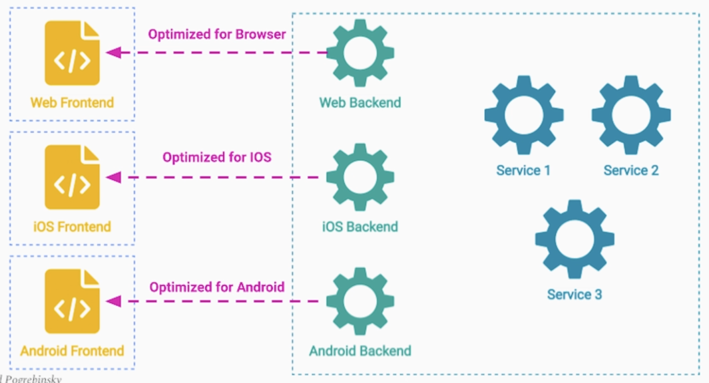

More importantly, it's code is **fully dedicated to provide the best and most optimal experience** for that particular web frontend only

**Organizational Side**

- we can have a dedicated team of full stack developers dedicated to each pair of frontend / backend
- e.g. iOS Team doesn't have to depend on another team

---

### Backends For Frontends - Challenges

- One backend - All functionality is in one place
- Multiple backends - How to avoid duplicating shared functionality?
- Granularity - How many types of Backend For Frontends?

**Example: E-commerce platform**

Web frontend / iOS Frontend / Android Frontend
- Different shopping experience but a few parts remain the same
- e.g. login, signup, checkout require the same inputs and business logic
- can use a **shared library** and reuse it across multiple services

---

### Shared Library - Issues

- A shared library may
  - Tightly couple codebases
  - Create friction between teams
- Reason
  - Changes in the shared library affect all backends and requires
    - Coordination
    - Meetings
    - Thorough testing
    - Lack of ownership

Another approach is to have the shared library as a separate service with a clear and well-defined scope / API / ownership

---

### Granularity of Backends for Frontends

How many types of Backend For Frontends?
- The answer is - "It depends"

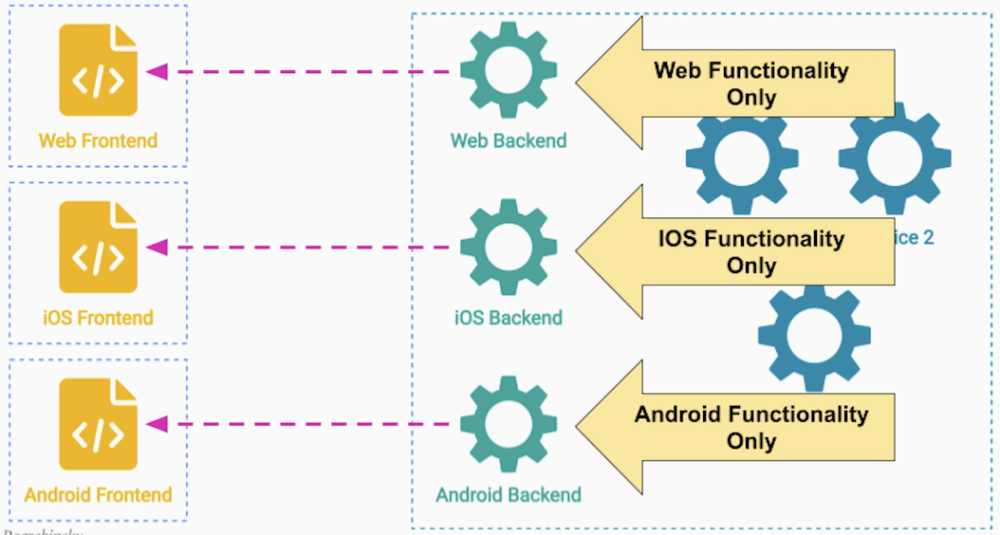

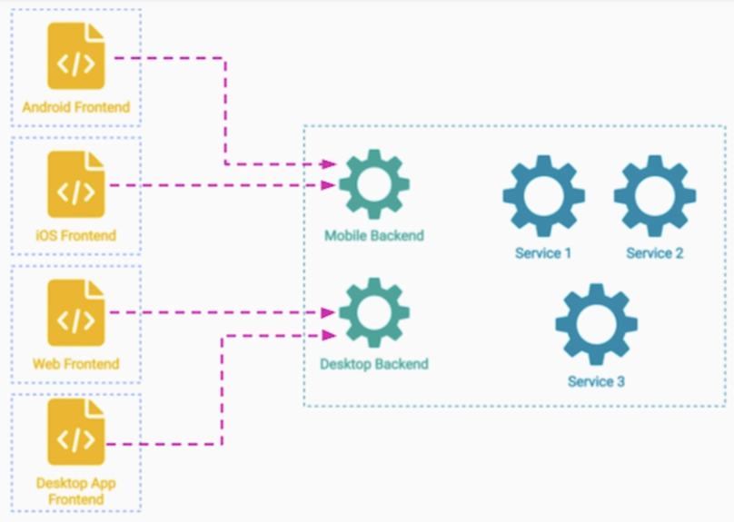

Examine difference between experiences between Android / iOS. Yes? Should have two separate dedicated backends. No? should add extra granularity

---

### Cloud Environment Configuration

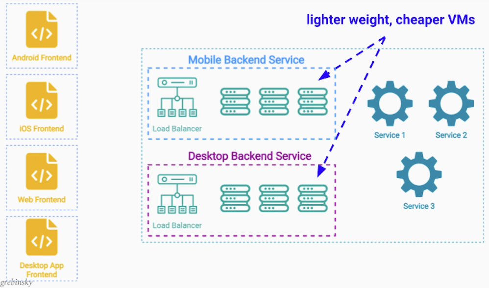

If we decide to run more server side computations for mobile frontends, we may need machines that have stronger CPUs or have more memory

---

### Request Routing

We can also utilize the cloud computing load balancing service to route requests to the right type of backend, using
- URI paths
- URL parameters
- HTTP Headers
  - e.g. User agent header which tells what type of device or platform the request is coming from

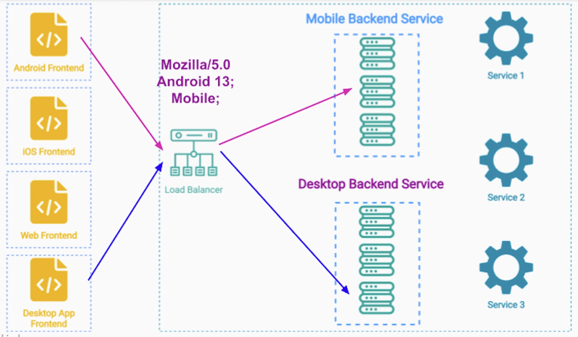

---

## Summary 

- Problem with multiple types of frontends interacting with a monolithic backend
  - Code complexity
  - Device / frontend based features
  - Friction between 2 separate (frontend and backend) development teams
- Solution: **Backends For Frontends**
  - Separate services
  - Fullstack teams with full end-to-end ownership
- Challenges
  - Share common logic
  - Granularity of backends

---

