# Section 5: Reliability, Error Handling and Recovery Software Architecture Patterns

- [Throttling and Rate Limiting Pattern](#throttling-and-rate-limiting-pattern)
- [Retry Pattern](#retry-pattern)
- [Circuit Breaker](#circuit-breaker)
- [Dead Letter Queue (DLQ)](#dead-letter-queue-dlq)

---

## Throttling and Rate Limiting Pattern

### Problem Statement

**2 main problems this pattern helps us address**

- Overconsumption of resources in our system
  - our system can't handle this high rate of requests / data
    - service instances run out of CPU / Memory
    - violates the service level agreement for all clients ➡️ financial implications
  - can respond quickly and scale out our system using Load Balancer and auto scaling policies
    - scale out costs way more money
- Overconsumption of external system / external API
  - Example: Big Data Analysis
  - perform analysis as batch processing job (e.g. trends in user behavior of a social media app)
    - Generate recommendations for users
  - we may consume storage resources / network of cloud provider
  - we may use an external ML API

**Overconsumption - Conclusions**

- We need to protect our systems against traffic spikes
- Overconsumption of external resources may end up costing us a lot of money

**Solution**: **Throttling / Rate Limiting Pattern**

---

### Throttling Pattern

We set a limit on the **number of requests** that can be made during a period of time

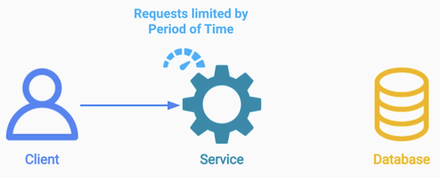

We can also impose limits **on the bandwidth and set a maximum number of MBs / GBs** of data that can either be sent or read from our system at a given period of time

This period can be
- / second
- / minute
- / day etc

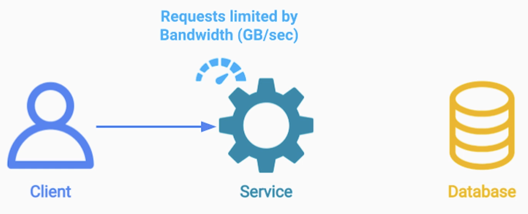

When we are the service providers, we need to protect our system from over consumption
- Server Side Throttling

When we are the clients, calling external services and we want to protect ourselfs from overspending
- Client Side Throttling

---

### Throttling & Rate Limiting - Open Questions

- What should we do if a client exceeds a set limit?

---

### Strategies for Handling a Client Exceeding the Limit

- Dropping Requests
  - Send back a response with error code 429 - "Too many requests"
- Queue up the requests and process them later
- Reduce Quality / Limit Bandwidth

---

### Example: Stock Trading Company

**Dropping Requests**

We can throttle the number of requests / sec a client can send us to get the price of a stock.

If the client attempts to send us more requests, we can simply drop and ignore them on the server side.

**Queue up**

We can simply queue those requests either in a log or a message broker and then execute those trades at a pace that does not exceed the limit we set for that client
- we simply slow down or degrate the service we provide to that client

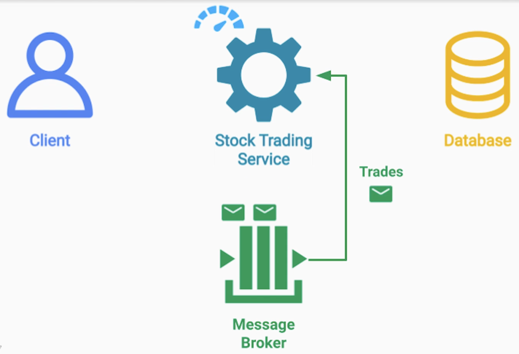

We can combine those strategies and set a limit on the number of trades we can perform per day, and if that daily limit is exceeded we start dropping those requests.

This will prevent a situation where the client keeps sending us more and more trading requests, which may in turn overload the capacity of our queue

---

### Example: Streaming Platform

We can throttle the client by reducing the resolution or bitrate of the video / audio.
- we essentially throttle the bandwidth without denying the service

If we detect that the client is maliciously trying to consume too much data, we can also set an upper limit on the number of movies or songs that they can watch or listen too

---

### Throttling & Rate Limiting - Important Considerations

- Whether to throttle on
  - API basis
  - Customer basis
- Multi-service throttling

---

### Global Rate Limit

We can look at the API endpoint and set a global rate limit for all the clients together to that endpoint.

The benefit of this approach is we can easily guarantee that our system does not go over the request rate that we can handle or budgeted for

The obvious downside is that one client can suddently send us a very high number of requests and therefore unfairly deprive the other clients of getting service

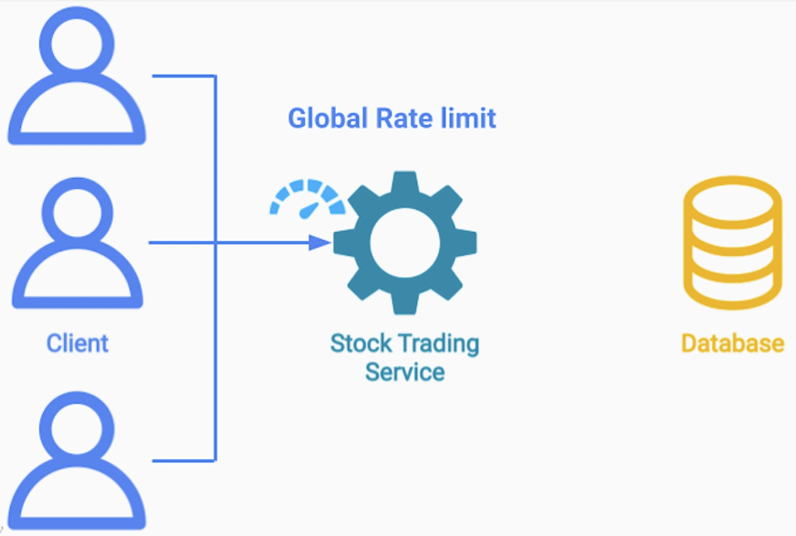

On the other hand we can implement throttling on a per customer basis.

This way we guarantee that each customer gets a fair share of our resources and their level of service is isolated and independent from other customers.

The downside of this approach is now a lot harder for us to control the total request rate from all the customers
- especially gets harder if we constantly get new customers
- can also get very complex if we have multiple tiers of customers (Premium, Basic, Free) where each customer get different quotas based on the level of subscription

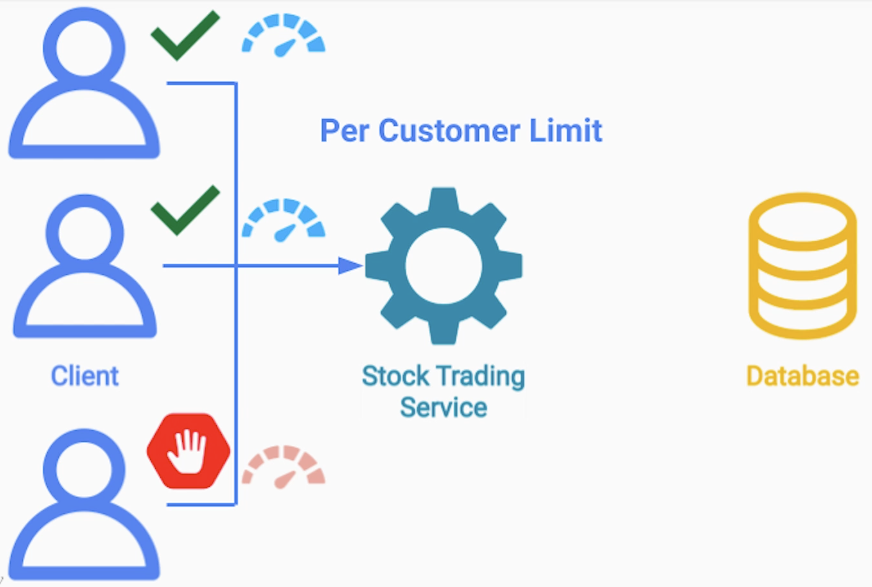

---

## Example: Stock Trading Company with multi-service throttling

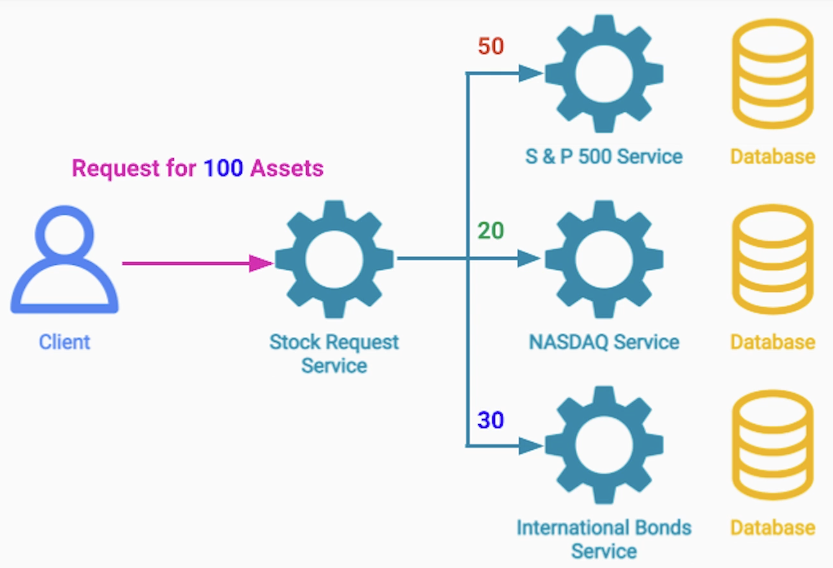

Each client can request a price of either one or multiple stocks / bonds or other asset classes, as a **single** request to our API endpoint.

Internally, that single request can result in multiple concurrent requests to different services

If we only throttle externally on an API basis or customer basis the we may end up overwhelming different parts of our system at different times depending on the workload - complex throttling.

---

### Summary

- Throttling - Setting a limit of the:
  - Number of requests
  - Amount of data can be sent / received per unit of time
- Types of throttling
  - Client Side Throttling
  - Server Side Throttling
- Important considerations
  - Customer base throttling vs Global (API level) throttling
  - External throttling vs Service based throttling
- Conclusion: The best approach depends on
  - Use-case
  - Requirements 

---

## Retry Pattern

### Problem Statement

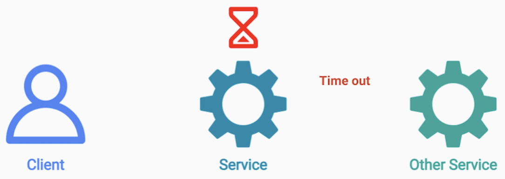

---

### Cloud Environment Issues

- Software / Hardware / Network errors introduce
  - Delays
  - Timeouts
  - Failures

**Two scenarios**
- 1. Successful Response
- 2. Error or Timeout

---

### Error Categorization

The first thing we need to do in the second scenario is error categorization
- User Error
  - HTTP 403 (Not Authorized)
    - We simply send the error back to the user: Error Info
- System Error
  - We need to try our best to hide the error from the user and recover if possible

Recover from system error solution: **Retry Pattern**

---

### Retry Pattern

We simply retry the same operation by resending the same request to the remote server until
we get a successful response

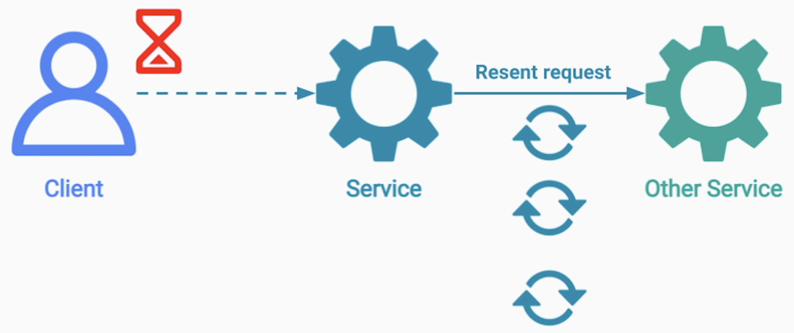

If we do get a successful response in a reasonable amount of time then we succeeded in hiding our internal issues
from the user

---

### Retry Pattern - Important Considerations

- Which errors to retry?
- What delay / backoff strategy to use?
- Adding randomization / Jitter between retries
- How many times / how long to retry?
- Is the operation idempotent?
- Where to implement the retry logic?

---

### Which Errors to Retry?

Only if we have reason to believe that the error is
- **Short**
- **Temporary**
- **Recoverable**

Example: HTTP 503 (Service Unavailable: Busy or down temporarily) 

Request may end up being routed by the load balancer to a different instance.

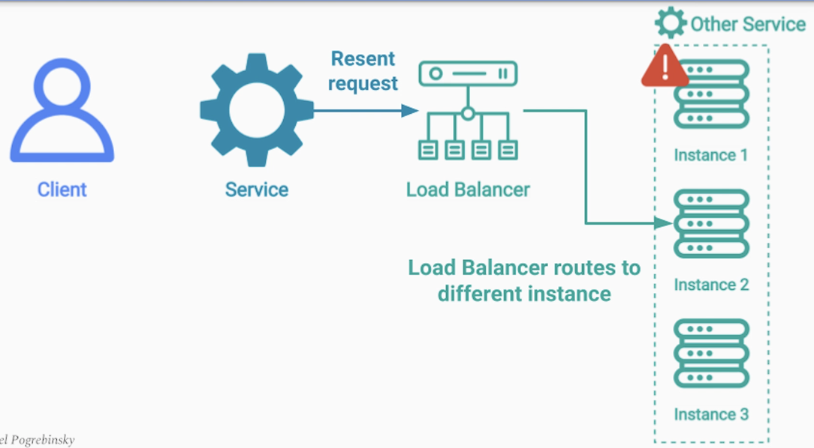

If the request ends up to the same instance there is a high chance that the instance has already recovered

---

### Retry Storm

> A situation that can cause unrecoverable cascading failure in the system

Example: 2 instances encountered failures and are in the process of getting fixed and restarted

For some duration are not available
- All the requests to them will fail
- Calling service will start sending retries
- Will be routed by the load balancer to the rest of the services

If we don't implement a delay or backoff in between retries, we may end up overwhelming the healthy instances
with more requests that they can handle
- This in turn will cause more timeouts and errors
- Will result in more retries

We can get to a point that the entire service goes down

Solution: Add a delay betweeen subsequent retries

---

### Retry Pattern - Backoff Strategy

- Allows the faulty service to fully recover
- Strategies
  - Fixed Delay
  - Incremental Delay
  - Exponential Backoff
- Note: The approach you choose depends on your system

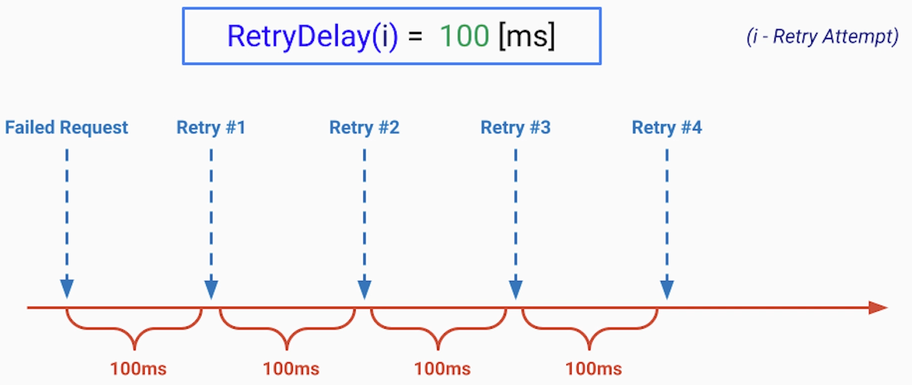

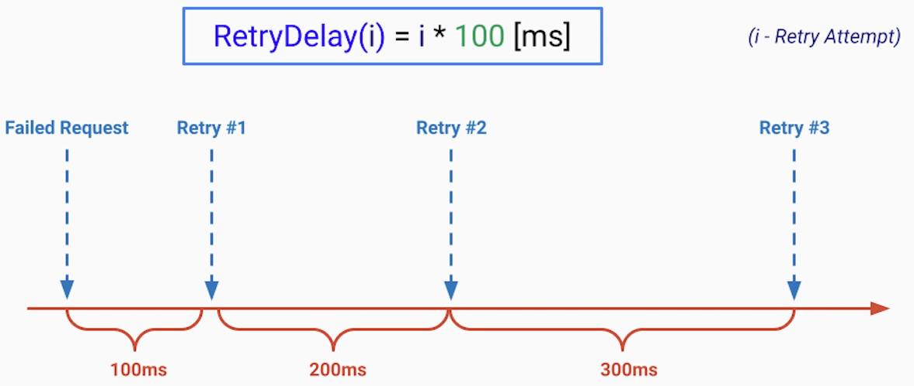

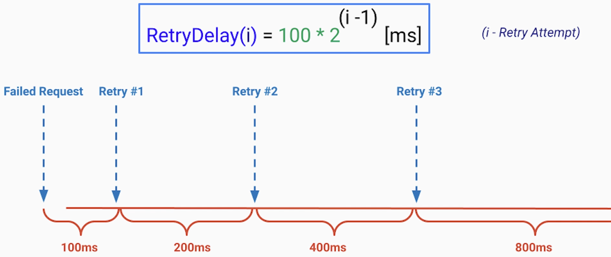

---

### Retry - Jitter

> RetryDelay(i) = i*(100 + rand(-15, 15))[ms]

All instances of one service see that instance crash at the same time

We may start sending retry requests to the rest of the remote service instances
- in complete or almost complete synchronization

Even with fixed or exponential delay - No delay randomization causes high load

---

### Synchronized Retries

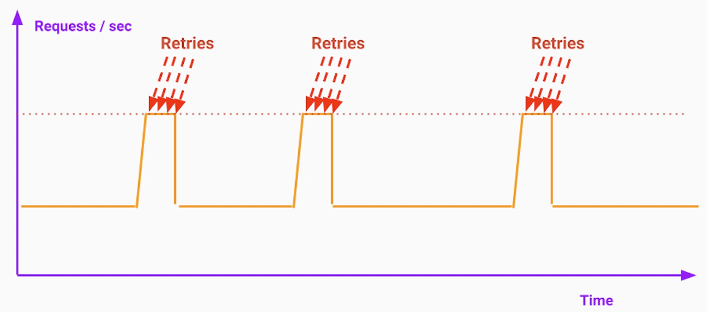

---

### Retries with Jitter

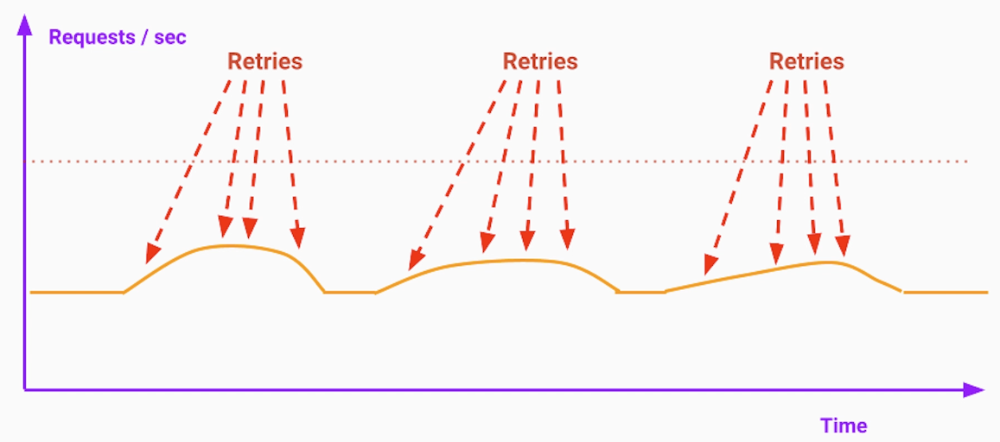

---

### Timeboxing

If the remote service we were trying to call, didn't respond or returned a successful result after 1 second

We can send back an error message that we are currently experiencing internal issues
- Timeout error

We also need to alert the engineers on-call

----

### Idempotency

If the service we are trying to call is the payment service, if we are not careful
- we may accidentally bill the user twice while retrying

Option 1: Payment Service did NOT Receive the Request

Option 2: The Confirmation from the Payment Service did NOT arrive

> Retrying **Idempotent** Operations is **Safe**

> Retrying **Non-Idempotent** Operations is **NOT Safe**

---

### Where to implement the retry logic?

- Reusing Shared Library reused by multiple services
- Moving that logic entirely off the service code
  - Deploying it as a separate process running on the same service instance
  - Ambassador Pattern
  - Application code is free from any retry logic

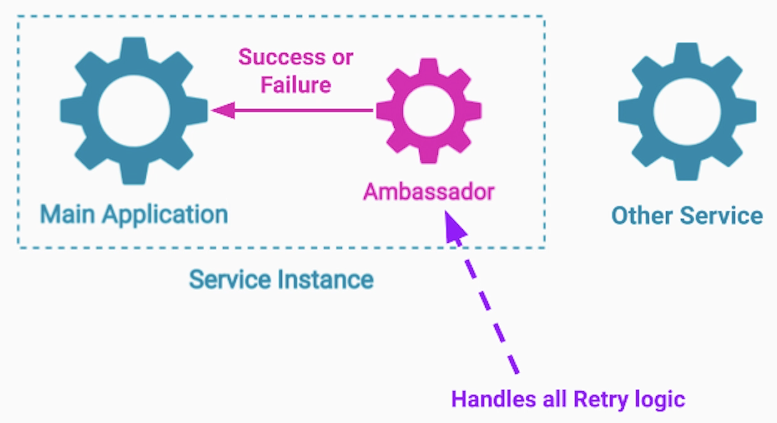

---

### Summary

- Learned about the Retry Pattern for handling errors
- Allows us to hide internal errors from the user by re-sending the request
- Important considerations
  - Retrying only : Short, Temporary and Recoverable errors
  - Delay between subsequent retries
  - Randomization / Jitter
  - Timeboxing / limiting the number of retry attempts
  - Idempotency
  - Retry implementation
    - Shared library
    - Ambassador Sidecar

---

## Circuit Breaker

### Circuit Breaker Pattern

- We used the Retry Pattern to handle system failures like
  - Timeouts
  - Server crashes
  - Network issues
- The main assumption was the failures are
  - Short
  - Temporary
  - Recoverable

**Example: Online Dating System**

Image System is down due to some serious issue

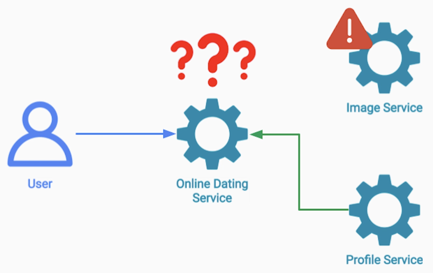

What should the online dating service do?

Since the issue is not short, temporary or recoverable then retrying a failed request to
that service is not going to help

---

### Circuit Breaker Pattern - Motivation

- The last N requests to the Image Service in the last minute failed
  - Should we keep retrying and holding the user?
  - or Save resources and NOT retry?
- Retry Pattern - **Optimistic** approach
  - First request failed next will succeed
- Circuit Breaker - **Pessimistic** approach
  - First requests failed next will also fail

Follows the electric circuit breaker analogy

---

### Circuit Breaker Pattern

The circuit breaker wraps the remote calls we make from one service to another.

In it's normal operation when the circuit is closed, the circuit breaker keeps track
of the number of successful requests and failed requests for any given period of time

e.g. 20 of the requests to a particular external service returned a successful response
and 2 of them timed out

As long as the failure rate stays low, the circuit remains closed and every request from our service
to external service is allowed to go through

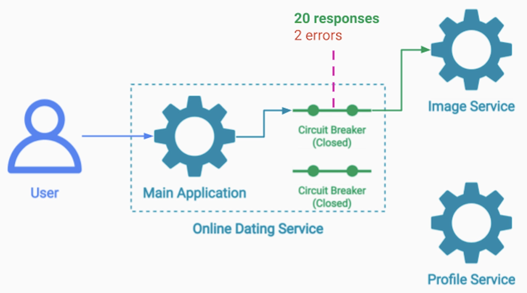

However, if at some point the failure rate exceeds a certain threshold, then the circuit breaker trips
and goes into an open state.

In the open state it stops any requests to go through and returns an error or throughs an exception
immediately to the caller

**This way we save the time waiting** for the image service to respond and also the **CPU and network resources**
for making those calls to the faulty service

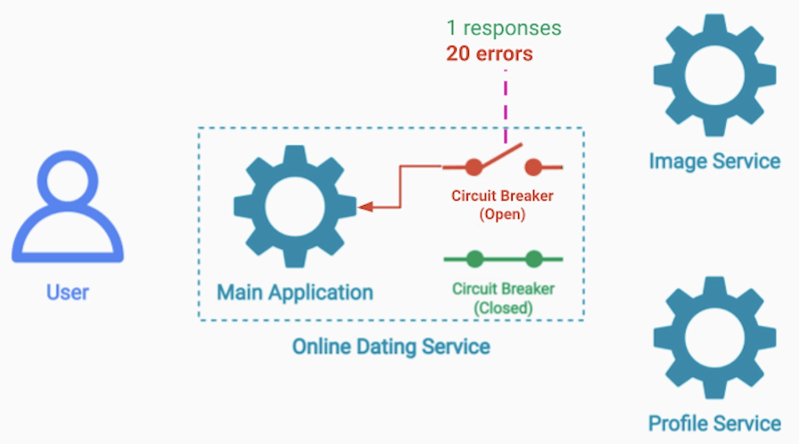

---

### Circuit Breaker Pattern - States

If we stop sending any requests to the faulty service, how will we know when it's back and healthy?

For that the circuit breaker has a third state: **Half-Open State**

Allows a small percentage of requests to go through and be sent to the remote service

If the success rate of those requests that do go through is high enough then the circuit braker assumes that the service recovered and transitioned back to the close state

Otherwise, if the success rate of those sample requests is still low then the circuit braker assumes that the service is still unhealthy and transitions back to the open state

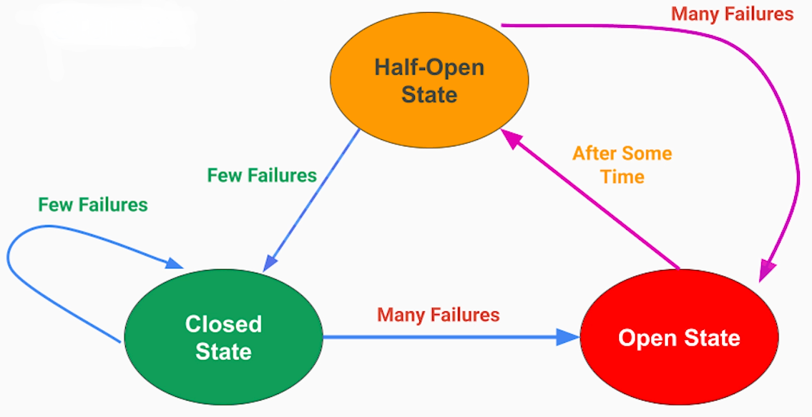

---

### Circuit Breaker Pattern - Important Considerations

- What to do with the outgoing request to the external service when the Circuit Breaker is open?
  - Drop it (with proper logging)
  - Log and Replay
- What response should we provide to the caller?
  - Fail Silently
    - e.g. no image / placeholder
  - Best Effort
    - e.g. send cached image
- Separate Circuit Breaker for every external service
- Replace the Half-Open state with Asynchronous Pings / Health Checks to the external Service
  - No real requests involved
  - Small requests without payload
  - Need to decide on frequency of pings
- Where to implement the Circuit Breaker Pattern?

---

### Implementation of Circuit Breaker Pattern

- 1. Circuit Breaker Library
- 2. Ambassador
     - runs along with our service instance on the same host

---

### Conclusion

Circuit Breaker Pattern is very powerful for handling long-lasting errors

---

### Summary

- Circuit Breaker is useful for errors that
  - There's no point in retrying
  - Very costly
- 3 States
  - Closed State
  - Open State
  - Half-Open State
- Important considerations
  - What to do with outgoing request in an Open State?
  - What response do we provide to the caller?
  - Separate Circuit Breaker for each external service
  - Replacing Half-Open State with Asynchronous health checks
  - Where to implement the Circuit Breaker Pattern?

---

## Dead Letter Queue (DLQ)

### Problem Statement

Dead Letter Queue can let us handle a variety of errors that involve publishing and consuming messages
through a Message Broker or a Distributed Message Queue

**Event-Driven Architecture**

Publisher ➡️ Message Broker ➡️ Consumer

**Event-Driven Architecture Benefits**

- Decoupling _producers_ from _consumers_
- Greater Scalability
- Asynchronous communication

**Event-Driven Online Store**

We have multiple topics and queues inside the Message Broker

We also have different logic inside the consumer services

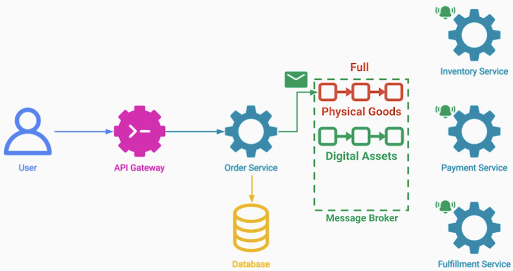

**Potential issues: Order Service gets a new order**

- but doesn't know which category it belongs (Non-existent topic)
- or send it to order that doesn't exist
- or send the order to a queue that is full
- or message itself exceeds size limit and MB keeps rejecting it
- or Consumer cannot process it
  - retrying doesn't help or makes things worst
  - can cause issue like queue limit exceeded / order delays

---

### Dead Letter Queue Pattern

- Special queue in a messagae broker for messages that cannot be delivered to their destination
- Types of ways for a message to get into the DLQ
  - Programmatic Publishing
    - e.g. if the order service doesn't know which topic to publish the message to
    - e.g. if consumers don't know how to read a message they can republish it back to the DLQ
  - Automatic transfer of messages from original queue
    - Requires support from Message Broker
    - e.g. publishing to a non-existing topic
    - e.g. if a message stayed in the Message Broker for too long

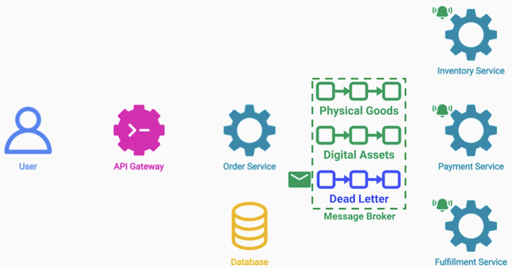

By using this pattern we can keep the normal, real-time pipeline in a healthy state and avoid
clogging the queue due to a few problematic messages
- Deal Letter messages are retained (and in order)

---

### Dead Letter Queue Pattern - Important Note

- It's important to add information about the reason for the failure to the message that gets into the DLQ
  - add a header to the message

---

### Dead Letter Queue Pattern - Open Questions

- What to do with the messages in the Dead Letter Queue?
  - Aggresive monitoring and alerting guarantee they don't just stay there
  - Messages in DQL indicate an Issue
    - Error details available from header
  - We can move messages back to original queue
  - We can process message manually

---

### Summary

- Learned about the Dead Letter Queue Pattern
- DLQ allows us to handle messages delivery failures in an Event Driven Architecture
- Ways to publish messages to the DLQ
  - Programmatic
  - Automated (by the Message Broker)
- Ways to process messages in the Dead Letter Queue
  - Fix and Republish
  - Manual (case-by case)

---

