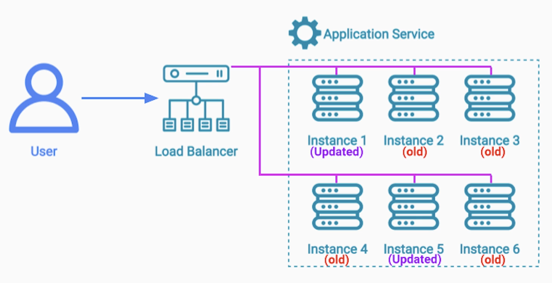
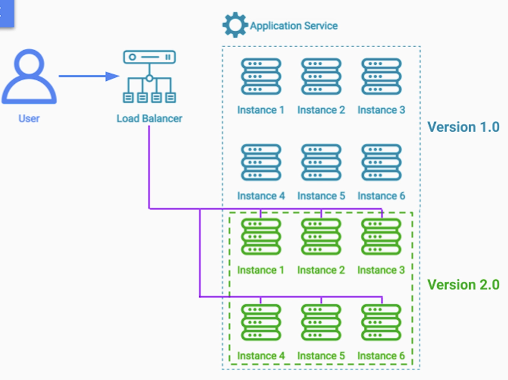
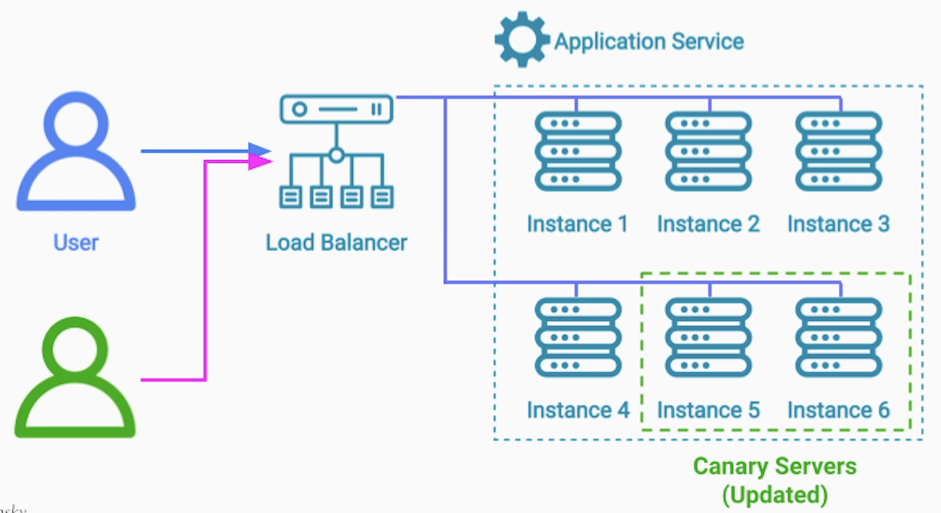
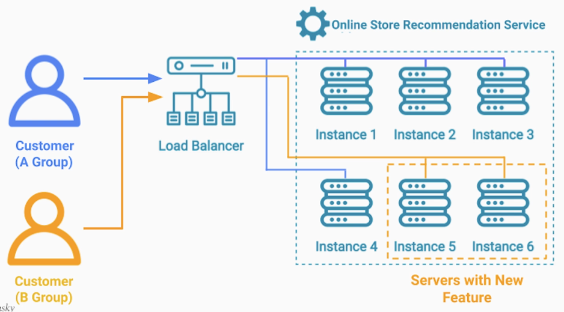
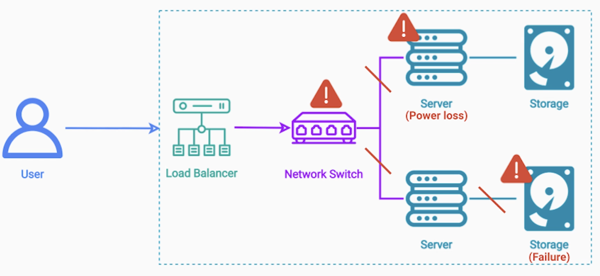
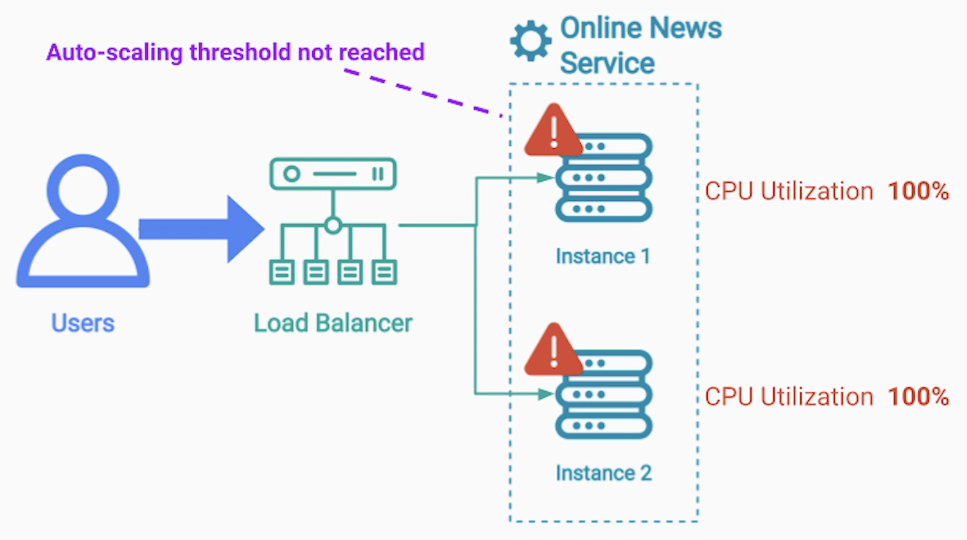
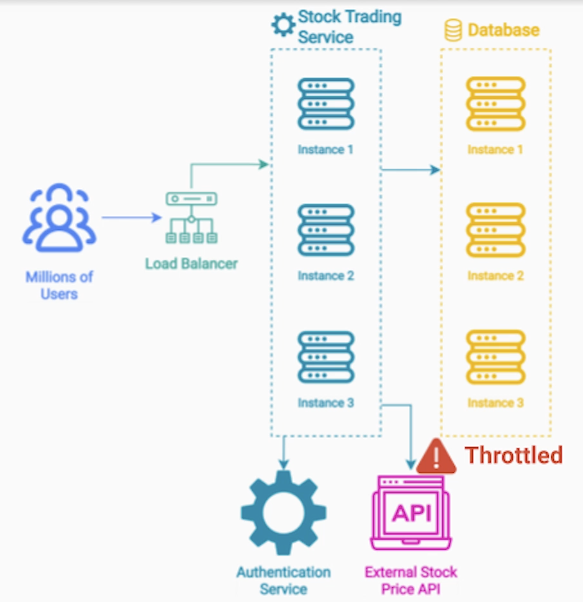

# Section 6: Deployment and Production Testing Patterns

- [Rolling Deployment Pattern](#rolling-deployment-pattern)
- [Blue-Green Deployment Pattern](#blue-green-deployment-pattern)
- [Canary Release and A/B Testing Deployment Patterns](#canary-release-and-ab-testing-deployment-patterns)
- [Chaos Engineering Production Testing Pattern](#chaos-engineering-production-testing-pattern)

---

## Deployment and Testing

- There's no value in "theorizing" about Highly Scalable / Fault Tolerant architectures without knowing how to:
  - Deploy
  - Upgrade
  - Test
them in production

---

### Problem Statement

Typically for upgrades it's required some downtime window, during that window we can:
- Shut down application instances
- Replace them with the new version

However, if for some reason, something goes wrong and the new version can't start up, 
we would need to shut those instances down and **Downgrade**
- Works fine if we can find a **No Traffic window**
- not an option for 24/7 busy applications

---

### Rolling Deployment Pattern

Instead of taking down all the servers, and deploying a new version on them,
- we use the **Load Balancing** service to stop sending traffic to the application servers
- one at a time

Once, no more traffic is going to a **particular server**:
- we can stop the application instance on it
- deploy a new instance with the new version

we can even run some tests if we want to

Then, we add that server back to the load balancer's group of backend servers
- we repeat the same process on all the servers

We can rollback the release, if we see errors in dashboards (steps to the reverse)

----

### Benefits

- No System Downtime
- Gradually release a new version - safer
- Fast and cheap to release a new version
  - No need to provision extra Hardware

---

### Downsides

- There is no isolation between the new old version servers
  - Risk of starting a cascade of failures
- Traffic will be sent to the remaining healthy old version
  - Old version has to handle more load (may cause them to start failing)

If the API has changed drastically, having two versions of the same service may cause issues

---

### Rolling Deployment - Conclusion

- Rolling Deployment is
  - One of the most popular deployment patterns
  - Used by many companies and projects

---

### Summary

- Rolling Deployment benefits
  - No downtime
  - No additional cost for hardware
  - We can rollback quickly if something goes wrong
- Downsides
  - Potential for Cascading Failures
  - 2 versions in production at the same time

---

## Blue-Green Deployment Pattern

### Problem Statement

Rolling Deployment: One instance at a time -> keep rolling until entire service has new version
- Cascading failures
- 2 versions in production

---

### Blue / Green Deployment

- Blue Environment
  - we keep the old version of our application instances running **throughout the entire duration** of the release
- Green Environment
  - deploy the new version on new servers

after we verified that the instances
- started up fine
- run a few tests on them

> We use the **load balancer to shift traffic** from the blue to the green environment

If during this transition we start seeing issues in logs / monitor dashboard, we can easily stop the release and shift the traffic back to the blue environment (old version).

Otherwise, we fully transfer the traffic to the new version and shut down the old environment (or keep it available for the next release)

---

### Blue-Green Deployment - Benefits

- We have an equal amount of servers for Blue and Green environemnts
  - if green environment fails, we can switch back to blue
  - can take the full load of traffic
- We can have a single version of the software at any given moment

---

### Blue-Green Deployment - Downsides

- We need twice as many servers as we normally need
  - in cloud we need to wait until all those servers start up
  - pay for additional hardware
  - if we use the **servers only for the release** - cost may not be high

> Most popular choice for releasing new version

---

## Canary Release and A/B Testing Deployment Patterns

### Canary Release

Borrows some elements from
- Rolling Deployment Pattern
- Blue-Green Deployment Pattern

We dedicate a small subset of the - existing - group of servers and update them
with the new version of our software
- we can direct specific users to those servers

Can be achieved by inspecting the **origin** in the Load Balancing service

During this time **we monitor the performance** of the canary version and compare it in real time
to the performance of the rest of the servers that run the old version

----

### Canary Release Pattern - Benefits and Challenges

- Benefits
  - Safety
    - we monitor the performance for days
- Challenges
  - Setting clear success criteria for automated release and monitoring

Internal Users or Beta Testers have
- higher tolerance for issues
- better knowledge of bug reporting

---

### A / B Testing or A / B Deployment Pattern

**Canary Release**: Goal is releasing new version safely

**A/B Testing**: Goal is testing new feature

- Similar to Canary Deployment but with a different purpose
- Can inform our product team for future features
- Experimental software is removed - reverted to previous software version

---

### A / B Testing: Online Store

Example: Test a new product recommendation algorithm

We want to test if the change will generate more revenue
- not ready to go full scale with the new version

We can deploy an experimental version of our recommendation service on a small set of servers

---

### A / B Testing Notes

- Users don't know they are part of an experiment
  - This gets us genuine data
- All of us take part in A/B Testing as users (without knowing it)
- Duration of the expirement depends on the use-case

When we conclude the experiment
- we divert traffic away from those experimental instances
- deploy the main version of our recommendation service back
- add them to the load balancing rotation

Data scientists can look the metrics gathered during the experiment and asess if the change should be released
as part of a future version

---

### Summary

- Both Canary Release and A / B Deployment Patterns allows us to dedicate a small portion of servers for a different version of software
- During the Canary Release
  - We monitor for
    - Performance
    - Functionality
  - Limit to internal users or beta testers
- During a A / B Testing
  - Prefer real traffic
  - By the end we roll back to the original version

---

## Chaos Engineering Production Testing Pattern

We can write
- Unit tests
  - Individual components of each service
- Functional tests
- Integration tests

to make sure that each service functions well at each own as well as in conjuction with other services

---

### Problem statement

In production, issues occur that we cannot test beforehand
- Infrastracture can break at any time
  - Servers can lose power
  - Network Switches can break down
  - DB devices can become unusable
- Natural disasters can hit the datacenters
- 3rd-Party Service Outage

---

### Chaos Engineering - Motivation

- We won't know about those issues until they actually happen
- When they do happen it may be too late
- Those issues are very rare
- The results of those issue can be catastrophic

> **Solution of Chaos Engineering**: Embracing the inherent chaos in a bloud-based Distributed System

  
**Example 1: Online News Magazine**

- Sudden external event occurs ➡️ Traffic spike
  - Can configure **LB auto-scaling** policy configured based on **requests/sec**
  - In reality, it's possible that before that threshold is met all servers become unusable
    - **CPU Utilization: 100%**
    - Very High Memory Consumption
   

  

**Example 2: Online Stock Trading Broker**

Configured LB for this scenario but

- Sudden Global Economic Event
  - Authentication Service Fails
  - External Stock Price API Throttled
  - Excessive queries to one database instance
 

  

> We won't know it fails until it happens

---

