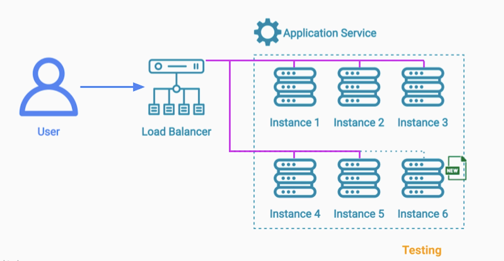

# Section 6: Deployment and Production Testing Patterns

- [Rolling Deployment Pattern](#rolling-deployment-pattern)

---

## Deployment and Testing

- There's no value in "theorizing" about Highly Scalable / Fault Tolerant architectures without knowing how to:
  - Deploy
  - Upgrade
  - Test
them in production

---

### Problem Statement

Typically for upgrades it's required some downtime window, during that window we can:
- Shut down application instances
- Replace them with the new version

However, if for some reason, something goes wrong and the new version can't start up, 
we would need to shut those instances down and **Downgrade**
- Works fine if we can find a **No Traffic window**
- not an option for 24/7 busy applications

---

### Rolling Deployment Pattern

Instead of taking down all the servers, and deploying a new version on them,
- we use the **Load Balancing** service to stop sending traffic to the application servers
- one at a time

Once, no more traffic is going to a **particular server**:
- we can stop the application instance on it
- deploy a new instance with the new version

we can even run some tests if we want to

Then, we add that server back to the load balancer's group of backend servers
- we repeat the same process on all the servers

We can rollback the release, if we see errors in dashboards (steps to the reverse)

----

### Benefits

- No System Downtime
- Gradually release a new version - safer
- Fast and cheap to release a new version
  - No need to provision extra Hardware

---

### Downsides

- There is no isolation between the new old version servers
  - Risk of starting a cascade of failures
- Traffic will be sent to the remaining healthy old version
  - Old version has to handle more load (may cause them to start failing)

If the API has changed drastically, having two versions of the same service may cause issues

---

### Rolling Deployment - Conclusion

- Rolling Deployment is
  - One of the most popular deployment patterns
  - Used by many companies and projects

---

### Summary

- Rolling Deployment benefits
  - No downtime
  - No additional cost for hardware
  - We can rollback quickly if something goes wrong
- Downsides
  - Potential for Cascading Failures
  - 2 versions in production at the same time

